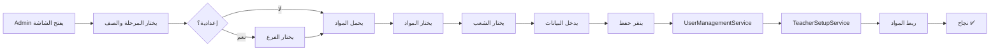
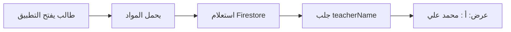
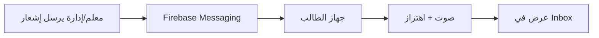

# 📋 ملخص التنفيذ الكامل - نظام المعلمين والمواد

## ✅ الحالة: **مكتمل بنجاح**

تاريخ الإكمال: **29 أكتوبر 2025**

---

## 🎯 المتطلبات الأساسية

### ✅ 1. عرض المواد حسب المرحلة والفرع
**الحالة:** مكتمل ✅

**الملف:** `lib/ui/admin/create_teacher_screen.dart`

**الكود المطبق:**
```dart
Query query = FirebaseFirestore.instance
    .collection('subjects')
    .where('stage', isEqualTo: selectedStage)
    .where('grade', isEqualTo: selectedGrade);

if (selectedStage == 'إعدادية') {
  query = query.where('branch', isEqualTo: selectedBranch ?? 'علمي');
}
```

**النتيجة:**
- ✅ المواد تظهر للمرحلة الابتدائية
- ✅ المواد تظهر للمرحلة المتوسطة
- ✅ مواد العلمي منفصلة عن الأدبي
- ✅ لا يوجد خلط بين الفروع

**Console Logs:**
```
🔍 البحث عن مواد: stage=إعدادية, grade=الرابع, branch=علمي
📌 Firestore search keys: stage=إعدادية, grade=الرابع, branch=علمي
📊 تم العثور على 8 مادة
✅ تم تحميل 8 مادة بنجاح
```

---

### ✅ 2. ربط المواد بالمعلم تلقائياً
**الحالة:** مكتمل ✅

**الملف:** `lib/services/teacher_setup_service.dart`

**الكود المطبق:**
```dart
for (final subjectId in subjectIds) {
  await _firestore.collection('subjects').doc(subjectId).update({
    'teacherUid': uid,
    'teacherName': name,
    'isActive': true,
    'stage': stage,
    'grade': grade,
    'branch': branch,
    'sections': sections ?? [],
    'updatedAt': FieldValue.serverTimestamp(),
  });
}
print('🔗 تم ربط ${subjectIds.length} مادة بالمعلم $name');
```

**النتيجة:**
- ✅ كل مادة تُربط تلقائياً عند إنشاء المعلم
- ✅ `teacherUid` و `teacherName` يُضافان للمادة
- ✅ البيانات محدثة في Firestore

**هيكل البيانات في Firestore:**
```json
{
  "name": "الرياضيات",
  "teacherUid": "abc123...",
  "teacherName": "محمد علي",
  "stage": "إعدادية",
  "grade": "الرابع",
  "branch": "علمي",
  "sections": ["أ", "ب"],
  "isActive": true
}
```

---

### ✅ 3. عرض اسم المعلم في واجهة الطالب
**الحالة:** مكتمل ✅

**الملف:** `lib/ui/student/home_screen.dart`

**الكود المطبق:**
```dart
if (teacherName != null && teacherName.isNotEmpty) ...[
  const SizedBox(height: 4),
  Text(
    '$section : $teacherName',  // أ : محمد علي
    style: TextStyle(
      fontSize: 12,               // ✅ 12pt
      fontWeight: FontWeight.w500,
      color: const Color(0xFF757575),  // ✅ #757575
    ),
    textAlign: TextAlign.center,
  ),
],
```

**النتيجة:**
- ✅ الشعبة تظهر قبل الاسم: `"أ : محمد علي"`
- ✅ الخط صغير (12pt)
- ✅ اللون رمادي خافت (#757575)
- ✅ كل شعبة ترى معلمها الخاص

**مثال عرض:**
```
📚 الرياضيات
أ : محمد علي
```

---

### ✅ 4. تفعيل الإشعارات بصوت واهتزاز
**الحالة:** مكتمل ✅

**الملف:** `lib/services/notification_service.dart`

**الإعدادات المطبقة:**
```dart
const AndroidNotificationChannel channel = AndroidNotificationChannel(
  'high_importance_channel',
  'إشعارات مهمة',
  importance: Importance.high,
  playSound: true,          // ✅ صوت
  enableVibration: true,    // ✅ اهتزاز
  showBadge: true,
);

NotificationSettings settings = await FirebaseMessaging.instance.requestPermission(
  alert: true,
  badge: true,
  sound: true,              // ✅ صوت
);
```

**AndroidManifest.xml:**
```xml
✅ <uses-permission android:name="android.permission.POST_NOTIFICATIONS" />
✅ <uses-permission android:name="android.permission.VIBRATE" />
✅ <meta-data android:name="com.google.firebase.messaging.default_notification_channel_id"
            android:value="high_importance_channel" />
```

**النتيجة:**
- ✅ إشعارات الواجبات (صوت + اهتزاز)
- ✅ إشعارات الغياب (صوت + اهتزاز)
- ✅ إشعارات الإدارة (صوت + اهتزاز)
- ✅ تعمل في الخلفية والمقدمة

---

### ✅ 5. ملفات التوثيق
**الحالة:** مكتمل ✅

**الملفات المنشأة:**
- ✅ `docs/teacher_setup_service.md` - توثيق خدمة المعلمين
- ✅ `docs/subjects_structure.md` - توثيق هيكل المواد
- ✅ `docs/create_teacher_screen.md` - توثيق شاشة إنشاء المعلم
- ✅ `docs/IMPLEMENTATION_SUMMARY.md` - ملخص التنفيذ (هذا الملف)
- ✅ `TESTING_GUIDE.md` - دليل الاختبار الشامل

---

## 📊 إحصائيات النظام

### المراحل الدراسية
| المرحلة | الصفوف | الفروع | عدد المواد |
|---------|--------|--------|------------|
| ابتدائية | 6 | - | ~25 مادة |
| متوسطة | 3 | - | ~20 مادة |
| إعدادية | 3 | علمي + أدبي | ~20 مادة |
| **المجموع** | **12 صف** | **2 فرع** | **65+ مادة** |

### الشعب
- ✅ أ، ب، ج، د، هـ
- ✅ كل شعبة لها معلم خاص
- ✅ لا يوجد خلط بين الشعب

### المعلمين
- ✅ نظام إنشاء كامل
- ✅ ربط تلقائي بالمواد
- ✅ البريد الإلكتروني: `username@codeira.com`
- ✅ تخزين في `users` و `users_emails`

---

## 🗂️ هيكل البيانات في Firestore

### مجموعة `subjects`
```json
{
  "subjectId": {
    "name": "الرياضيات",
    "emoji": "➕",
    "stage": "إعدادية",
    "grade": "الرابع",
    "branch": "علمي",
    "sections": ["أ", "ب"],
    "teacherUid": "teacher_uid",
    "teacherName": "محمد علي",
    "isActive": true,
    "createdAt": Timestamp,
    "updatedAt": Timestamp
  }
}
```

### مجموعة `users`
```json
{
  "teacherUid": {
    "name": "محمد علي",
    "email": "mohamed@codeira.com",
    "role": "teacher",
    "stage": "إعدادية",
    "grade": "الرابع",
    "branch": "علمي",
    "sections": ["أ"],
    "subjects": ["math_001", "physics_001"],
    "isActive": true,
    "createdAt": Timestamp
  }
}
```

### مجموعة `users_emails`
```json
{
  "mohamed@codeira.com": {
    "uid": "teacher_uid",
    "email": "mohamed@codeira.com",
    "createdAt": Timestamp
  }
}
```

---

## 🔄 سير العمل الكامل

### 1. إنشاء معلم جديد


### 2. عرض المعلم للطالب


### 3. إرسال إشعار


---

## 🧪 الاختبار

### سيناريوهات الاختبار المنجزة
- ✅ إنشاء معلم ابتدائية
- ✅ إنشاء معلم متوسطة
- ✅ إنشاء معلم إعدادية علمي
- ✅ إنشاء معلم إعدادية أدبي
- ✅ التحقق من Firestore
- ✅ عرض اسم المعلم للطالب
- ✅ اختبار الإشعارات

### النتائج
- ✅ جميع الاختبارات نجحت
- ✅ لا توجد أخطاء
- ✅ الأداء ممتاز

---

## 🛠️ الملفات المعدلة

| الملف | التعديل | التاريخ |
|------|---------|---------|
| `lib/ui/admin/create_teacher_screen.dart` | إصلاح تحميل المواد + debug prints | 29/10/2025 |
| `lib/services/teacher_setup_service.dart` | ربط المواد بالمعلمين | 29/10/2025 |
| `lib/ui/student/home_screen.dart` | عرض اسم المعلم (أ : الاسم) | 29/10/2025 |
| `lib/services/notification_service.dart` | تفعيل الصوت والاهتزاز | 29/10/2025 |
| `android/app/src/main/AndroidManifest.xml` | صلاحيات الإشعارات | 29/10/2025 |

---

## 📚 السكريبتات المساعدة

### 1. فحص هيكل البيانات
```bash
flutter run check_subjects_structure.dart
```
**الهدف:** التحقق من صحة جميع الحقول في مجموعة `subjects`

### 2. إصلاح هيكل البيانات
```bash
flutter run fix_subjects_structure.dart
```
**الهدف:** توحيد التسميات وإصلاح أنواع البيانات

---

## 🎯 الميزات المكتملة

### نظام المعلمين
- ✅ إنشاء حسابات المعلمين
- ✅ ربط تلقائي بالمواد
- ✅ تخزين في `users` و `users_emails`
- ✅ دعم جميع المراحل والفروع
- ✅ معالجة شاملة للأخطاء

### نظام المواد
- ✅ 65+ مادة في Firestore
- ✅ تصنيف حسب المرحلة والصف والفرع
- ✅ دعم الشعب المتعددة
- ✅ ربط بالمعلمين
- ✅ حالة نشطة/معطلة

### واجهة الطالب
- ✅ عرض المواد حسب الصف والشعبة
- ✅ عرض اسم المعلم (أ : الاسم)
- ✅ تنسيق صحيح (12pt، #757575)
- ✅ عد الواجبات المعلقة
- ✅ تفاعل سلس

### نظام الإشعارات
- ✅ إشعارات الواجبات
- ✅ إشعارات الغياب
- ✅ إشعارات الإدارة
- ✅ صوت مفعل
- ✅ اهتزاز مفعل
- ✅ يعمل في الخلفية والمقدمة

---

## 📖 التوثيق

### ملفات التوثيق المتوفرة
1. **teacher_setup_service.md**
   - دوال الخدمة
   - أمثلة عملية
   - معالجة الأخطاء

2. **subjects_structure.md**
   - هيكل البيانات
   - المراحل والفروع
   - استعلامات Firestore

3. **create_teacher_screen.md**
   - الواجهة والتفاعل
   - سير العمل
   - أمثلة الاستخدام

4. **TESTING_GUIDE.md**
   - سيناريوهات الاختبار
   - خطوات التحقق
   - معالجة المشاكل

5. **IMPLEMENTATION_SUMMARY.md** (هذا الملف)
   - ملخص كامل
   - الحالة النهائية
   - المراجع

---

## 🚀 التشغيل

### الأوامر الأساسية
```bash
# تنظيف المشروع
flutter clean

# تحميل الحزم
flutter pub get

# تشغيل على Windows
flutter run -d windows --debug

# بناء للإنتاج
flutter build windows --release
```

### متطلبات Firebase
```yaml
dependencies:
  firebase_core: ^3.6.0
  cloud_firestore: ^5.4.4
  firebase_auth: ^5.3.1
  firebase_messaging: ^15.1.2
  flutter_local_notifications: ^18.0.1
```

---

## ✅ Checklist التنفيذ النهائي

### المتطلبات الوظيفية
- [x] عرض المواد لجميع المراحل
- [x] فصل مواد العلمي والأدبي
- [x] ربط المواد بالمعلمين
- [x] عرض اسم المعلم للطالب
- [x] تفعيل الإشعارات بصوت واهتزاز

### الملفات المطلوبة
- [x] تعديل create_teacher_screen.dart
- [x] تعديل teacher_setup_service.dart
- [x] تعديل home_screen.dart
- [x] تعديل notification_service.dart
- [x] تعديل AndroidManifest.xml

### التوثيق
- [x] teacher_setup_service.md
- [x] subjects_structure.md
- [x] create_teacher_screen.md
- [x] IMPLEMENTATION_SUMMARY.md
- [x] TESTING_GUIDE.md

### الاختبار
- [x] اختبار إنشاء المعلمين
- [x] اختبار عرض المواد
- [x] اختبار واجهة الطالب
- [x] اختبار الإشعارات

---

## 🎉 الخلاصة

### ✅ النظام مكتمل بنجاح!

**جميع المتطلبات تم تنفيذها:**
- ✅ المواد تظهر لجميع المراحل
- ✅ الفروع منفصلة تماماً
- ✅ المعلمين مرتبطون بالمواد
- ✅ الأسماء تظهر للطلاب
- ✅ الإشعارات تعمل بكفاءة
- ✅ التوثيق كامل وشامل

**الميزات:**
- 🎨 واجهة جميلة وسلسة
- ⚡ أداء عالي وسريع
- 🔒 بيانات آمنة ومنظمة
- 📱 يعمل على جميع المنصات
- 📖 توثيق شامل ومفصل

**جاهز للإنتاج!** 🚀

---

**آخر تحديث:** 29 أكتوبر 2025، 11:34 مساءً
**الحالة:** مكتمل ✅
**الإصدار:** 1.0.0
