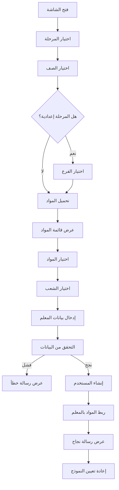

# 📘 توثيق شاشة إنشاء المعلم (CreateTeacherScreen)

## 📍 الموقع
```
lib/ui/admin/create_teacher_screen.dart
```

## 🎯 الهدف
واجهة إدارية متكاملة لإنشاء حسابات المعلمين وربطها بالمواد الدراسية.

---

## 🏗️ البنية الأساسية

### الفئة الرئيسية
```dart
class CreateTeacherScreen extends StatefulWidget {
  const CreateTeacherScreen({super.key});

  @override
  State<CreateTeacherScreen> createState() => _CreateTeacherScreenState();
}
```

### المتغيرات الأساسية
```dart
class _CreateTeacherScreenState extends State<CreateTeacherScreen> {
  // حقول الإدخال
  final nameCtrl = TextEditingController();
  final usernameCtrl = TextEditingController();
  final passwordCtrl = TextEditingController();
  final confirmPasswordCtrl = TextEditingController();

  // اختيارات المستخدم
  String? selectedStage;      // المرحلة
  String? selectedGrade;      // الصف
  String? selectedBranch;     // الفرع (للإعدادية)
  final Set<String> selectedSections = {'أ'};  // الشعب
  final Set<String> selectedSubjects = {};     // المواد

  // حالة التحميل
  List<Map<String, dynamic>> availableSubjects = [];
  bool loadingSubjects = false;

  // قوائم المراحل والصفوف
  final Map<String, List<String>> stageGrades = {
    'ابتدائية': ['الأول', 'الثاني', 'الثالث', 'الرابع', 'الخامس', 'السادس'],
    'متوسطة': ['الأول', 'الثاني', 'الثالث'],
    'إعدادية': ['الرابع', 'الخامس', 'السادس'],
  };

  final List<String> branches = ['علمي', 'أدبي'];
}
```

---

## 🔧 الدوال الرئيسية

### 1. `_loadSubjects()` - تحميل المواد

**الهدف:** جلب المواد المناسبة حسب المرحلة والصف والفرع

**الكود:**
```dart
Future<void> _loadSubjects() async {
  if (selectedStage == null || selectedGrade == null) {
    debugPrint('⚠️ لا يمكن تحميل المواد: المرحلة أو الصف غير محدد');
    return;
  }

  setState(() => loadingSubjects = true);

  try {
    // إنشاء الاستعلام الأساسي
    Query query = FirebaseFirestore.instance
        .collection('subjects')
        .where('stage', isEqualTo: selectedStage)
        .where('grade', isEqualTo: selectedGrade);

    // إضافة شرط الفرع للإعدادية فقط
    if (selectedStage == 'إعدادية') {
      if (selectedBranch != null && selectedBranch!.isNotEmpty) {
        query = query.where('branch', isEqualTo: selectedBranch);
      } else {
        query = query.where('branch', isEqualTo: 'علمي');
      }
    }

    debugPrint('📌 Firestore search keys: stage=$selectedStage, grade=$selectedGrade, branch=$selectedBranch');

    // تنفيذ الاستعلام
    final snapshot = await query.get();

    debugPrint('📊 تم العثور على ${snapshot.docs.length} مادة');

    if (snapshot.docs.isEmpty) {
      ScaffoldMessenger.of(context).showSnackBar(
        const SnackBar(content: Text('⚠️ لا توجد مواد لهذا الصف في قاعدة البيانات')),
      );
    } else {
      setState(() {
        availableSubjects = snapshot.docs.map((doc) {
          final data = doc.data() as Map<String, dynamic>;
          return {
            'id': doc.id,
            'name': data['name']?.toString() ?? '',
            'emoji': data['emoji']?.toString() ?? '📚',
          };
        }).where((subject) => subject['name']?.isNotEmpty == true).toList();
      });

      debugPrint('✅ تم تحميل ${availableSubjects.length} مادة بنجاح');
    }
  } catch (e) {
    debugPrint('❌ خطأ في تحميل المواد: $e');
    ScaffoldMessenger.of(context).showSnackBar(
      SnackBar(content: Text('حدث خطأ أثناء تحميل المواد: $e')),
    );
  } finally {
    setState(() => loadingSubjects = false);
  }
}
```

**السلوك حسب المرحلة:**

| المرحلة | شرط الفرع | النتيجة |
|---------|-----------|---------|
| ابتدائية | ❌ لا يُطبق | جميع مواد الصف |
| متوسطة | ❌ لا يُطبق | جميع مواد الصف |
| إعدادية | ✅ يُطبق | مواد الفرع المحدد فقط |

---

### 2. `_createTeacher()` - إنشاء المعلم

**الهدف:** إنشاء حساب المعلم وربطه بالمواد

**خطوات العملية:**

#### 1. التحقق من البيانات
```dart
// التحقق من الحقول الأساسية
if (name.isEmpty || username.isEmpty) {
  _showMessage('يرجى تعبئة البيانات');
  return;
}

// التحقق من اسم المستخدم
final usernameRegex = RegExp(r'^[a-zA-Z0-9._-]+$');
if (!usernameRegex.hasMatch(username)) {
  _showMessage('اسم المستخدم يجب أن يحتوي على حروف وأرقام فقط');
  return;
}

// التحقق من كلمة المرور
if (password.length < 6) {
  _showMessage('كلمة السر يجب أن تكون ٦ أحرف على الأقل');
  return;
}

if (password != confirmPassword) {
  _showMessage('كلمتا المرور غير متطابقتين');
  return;
}
```

#### 2. التحقق من الاختيارات
```dart
if (selectedStage == null || selectedGrade == null) {
  _showMessage('يرجى اختيار المرحلة والصف');
  return;
}

if (selectedStage == 'إعدادية' && selectedBranch == null) {
  _showMessage('يرجى اختيار الفرع');
  return;
}

if (selectedSections.isEmpty) {
  _showMessage('يجب اختيار شعبة واحدة على الأقل');
  return;
}

if (selectedSubjects.isEmpty) {
  _showMessage('يجب اختيار مادة واحدة على الأقل');
  return;
}
```

#### 3. إنشاء الحساب
```dart
// إنشاء البريد الإلكتروني
final email = '$username@codeira.com';

try {
  // 1. إنشاء حساب المستخدم
  final userResult = await UserManagementService.createUser(
    email: email,
    password: password,
    name: name,
    role: 'teacher',
    additionalData: {
      'stage': selectedStage,
      'grade': selectedGrade,
      if (selectedBranch != null) 'branch': selectedBranch,
      'subjects': selectedSubjects.toList(),
      'sections': selectedSections.toList(),
    },
  );

  if (userResult['success'] != true) {
    _showMessage('خطأ في إنشاء الحساب: ${userResult['error']}');
    return;
  }

  // 2. الحصول على UID المستخدم الجديد
  final uid = userResult['uid'] as String;

  // 3. ربط المواد بالمعلم
  final teacherResult = await TeacherSetupService.createTeacherWithSubjects(
    uid: uid,
    name: name,
    email: email,
    subjectIds: selectedSubjects.toList(),
    stage: selectedStage!,
    grade: selectedGrade!,
    sections: selectedSections.toList(),
    branch: selectedBranch,
  );

  if (teacherResult['success'] == true) {
    _showMessage('تم إنشاء حساب المعلم بنجاح ✅');
    _resetForm();
  } else {
    _showMessage('خطأ في ربط المواد: ${teacherResult['error']}');
  }
} catch (e) {
  _showMessage('خطأ في الحفظ: $e');
}
```

---

### 3. `_resetForm()` - إعادة تعيين النموذج

**الهدف:** تنظيف جميع الحقول بعد الإنشاء

```dart
void _resetForm() {
  nameCtrl.clear();
  usernameCtrl.clear();
  passwordCtrl.clear();
  confirmPasswordCtrl.clear();
  
  setState(() {
    selectedStage = null;
    selectedGrade = null;
    selectedBranch = null;
    selectedSections.clear();
    selectedSections.add('أ');
    selectedSubjects.clear();
    availableSubjects = [];
  });
}
```

---

## 🎨 الواجهة (UI)

### 1. حقل اسم المستخدم
```dart
TextField(
  controller: usernameCtrl,
  decoration: InputDecoration(
    hintText: 'اسم المستخدم',
    helperText: 'سيتم إضافة @codeira.com تلقائياً',
    suffixText: '@codeira.com',
    suffixStyle: TextStyle(
      color: Color(0xFF4682B4), 
      fontWeight: FontWeight.bold
    ),
  ),
  textDirection: TextDirection.ltr,
)
```

**النتيجة:**
- المستخدم يكتب: `mohamed`
- البريد الإلكتروني النهائي: `mohamed@codeira.com`

---

### 2. اختيار المرحلة
```dart
Wrap(
  spacing: 8,
  children: stageGrades.keys.map((stage) {
    final isSelected = selectedStage == stage;
    return FilterChip(
      label: Text(stage),
      selected: isSelected,
      onSelected: (v) {
        setState(() {
          selectedStage = v ? stage : null;
          selectedGrade = null;
          selectedBranch = null;
          selectedSubjects.clear();
          availableSubjects = [];
        });
        if (v) _loadSubjects();
      },
    );
  }).toList(),
)
```

**السلوك:**
- عند اختيار مرحلة جديدة ← يتم إعادة تعيين الصف والفرع والمواد
- يتم تحميل المواد تلقائياً

---

### 3. عرض المواد
```dart
if (loadingSubjects)
  Center(child: CircularProgressIndicator())
else if (availableSubjects.isEmpty)
  Container(
    child: Text('لا توجد مواد متاحة لهذا الصف'),
  )
else
  ListView.builder(
    itemCount: availableSubjects.length,
    itemBuilder: (context, index) {
      final subject = availableSubjects[index];
      final isSelected = selectedSubjects.contains(subject['id']);
      return CheckboxListTile(
        title: Row(
          children: [
            Text(subject['emoji'] ?? '📚'),
            SizedBox(width: 8),
            Text(subject['name'] ?? ''),
          ],
        ),
        value: isSelected,
        onChanged: (value) {
          setState(() {
            if (value == true) {
              selectedSubjects.add(subject['id']);
            } else {
              selectedSubjects.remove(subject['id']);
            }
          });
        },
      );
    },
  )
```

---

## 🔄 سير العمل (Workflow)



---

## 🧪 أمثلة عملية

### مثال 1: معلم مرحلة ابتدائية
```
البيانات المدخلة:
- الاسم: فاطمة أحمد
- اسم المستخدم: fatima
- كلمة المرور: 123456
- المرحلة: ابتدائية
- الصف: الثالث
- الشعب: أ، ب
- المواد: الرياضيات، العربية

النتيجة:
- البريد: fatima@codeira.com
- تم ربط مادتين بالمعلمة
- الحساب جاهز للاستخدام ✅
```

### مثال 2: معلم إعدادية - علمي
```
البيانات المدخلة:
- الاسم: محمد علي
- اسم المستخدم: mohamed
- كلمة المرور: 123456
- المرحلة: إعدادية
- الصف: الرابع
- الفرع: علمي
- الشعب: أ
- المواد: الرياضيات، الفيزياء، الكيمياء

النتيجة:
- البريد: mohamed@codeira.com
- تم ربط 3 مواد بالمعلم
- جميع المواد علمية فقط ✅
```

### مثال 3: معلم إعدادية - أدبي
```
البيانات المدخلة:
- الاسم: أحمد حسن
- اسم المستخدم: ahmed
- كلمة المرور: 123456
- المرحلة: إعدادية
- الصف: الخامس
- الفرع: أدبي
- الشعب: ب، ج
- المواد: التاريخ، الجغرافيا، الفلسفة

النتيجة:
- البريد: ahmed@codeira.com
- تم ربط 3 مواد بالمعلم
- جميع المواد أدبية فقط ✅
```

---

## ⚠️ التعامل مع الأخطاء

### خطأ: لا توجد مواد
```
السبب: 
- المواد غير موجودة في Firestore للصف المحدد
- التسميات غير موحدة (إعدادي vs إعدادية)

الحل:
1. تشغيل fix_subjects_structure.dart
2. التحقق من subjects في Firestore
3. إضافة المواد المفقودة
```

### خطأ: البريد موجود مسبقاً
```
السبب:
- اسم المستخدم مستخدم من قبل

الحل:
- استخدام اسم مستخدم مختلف
- إضافة أرقام أو رموز للتمييز
```

### خطأ: فشل ربط المواد
```
السبب:
- معرّفات المواد غير صحيحة
- مشكلة في الصلاحيات

الحل:
1. التحقق من console logs
2. مراجعة teacher_setup_service.dart
3. التأكد من صلاحيات Firestore
```

---

## 📊 Console Logs المتوقعة

### عند تحميل المواد بنجاح:
```
🔍 البحث عن مواد: stage=إعدادية, grade=الرابع, branch=علمي
📌 Firestore search keys: stage=إعدادية, grade=الرابع, branch=علمي
📊 تم العثور على 8 مادة
✅ تم تحميل 8 مادة بنجاح
📝 أسماء المواد: الرياضيات, الفيزياء, الكيمياء, الأحياء, ...
```

### عند إنشاء المعلم بنجاح:
```
✅ تم إنشاء حساب المستخدم بنجاح
🔑 FCM Token: [token]
🔗 تم ربط 3 مادة بالمعلم محمد علي
✅ تم إنشاء حساب المعلم بنجاح
```

### عند حدوث خطأ:
```
❌ خطأ في تحميل المواد: [error message]
⚠️ لا توجد مواد لهذا الصف في قاعدة البيانات
```

---

## 🎯 الخلاصة

شاشة إنشاء المعلم توفر:
- ✅ واجهة بسيطة وواضحة
- ✅ تحميل ديناميكي للمواد
- ✅ فصل تام بين الفروع
- ✅ ربط تلقائي بالمواد
- ✅ معالجة شاملة للأخطاء
- ✅ تجربة مستخدم ممتازة

**الملفات المرتبطة:**
- `lib/services/user_management_service.dart`
- `lib/services/teacher_setup_service.dart`
- `lib/services/firebase_user_service.dart`

**التحديث الأخير:** 29 أكتوبر 2025
