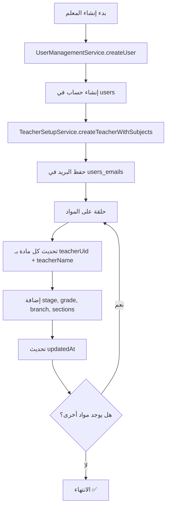

# 📘 توثيق خدمة إعداد المعلمين (TeacherSetupService)

## 📍 الموقع
```
lib/services/teacher_setup_service.dart
```

## 🎯 الهدف
خدمة متكاملة لإدارة حسابات المعلمين وربط المواد الدراسية بهم تلقائياً في Firestore.

---

## 🏗️ البنية الأساسية

### الاستيرادات المطلوبة
```dart
import 'package:cloud_firestore/cloud_firestore.dart';
```

### الفئة الرئيسية
```dart
class TeacherSetupService {
  static final FirebaseFirestore _firestore = FirebaseFirestore.instance;
}
```

---

## 📌 الدوال الرئيسية

### 1. `createTeacherWithSubjects`
**الوصف:** إنشاء حساب معلم وربطه بالمواد الدراسية

**المعاملات:**
- `uid` (String): معرّف المستخدم الفريد
- `name` (String): اسم المعلم
- `email` (String): البريد الإلكتروني
- `subjectIds` (List<String>): قائمة معرّفات المواد
- `stage` (String): المرحلة الدراسية
- `grade` (String): الصف
- `sections` (List<String>): قائمة الشعب
- `branch` (String?): الفرع (للإعدادية فقط)

**الخطوات:**
1. **حفظ البريد في `users_emails`:**
```dart
await _firestore.collection('users_emails').doc(email).set({
  'uid': uid,
  'email': email,
  'createdAt': FieldValue.serverTimestamp(),
});
```

2. **ربط المواد بالمعلم:**
```dart
for (final subjectId in subjectIds) {
  await _firestore.collection('subjects').doc(subjectId).update({
    'teacherUid': uid,
    'teacherName': name,
    'isActive': true,
    'stage': stage,
    'grade': grade,
    'branch': branch,
    'sections': sections ?? [],
    'updatedAt': FieldValue.serverTimestamp(),
  });
}
```

**القيمة المرجعة:**
```dart
{
  'success': true,
  'message': 'تم إنشاء حساب المعلم وربطه بالمواد بنجاح'
}
```

---

### 2. `updateTeacherSubjects`
**الوصف:** تحديث المواد المرتبطة بمعلم موجود

**المعاملات:**
- `teacherUid` (String): معرّف المعلم
- `subjectIds` (List<String>): قائمة معرّفات المواد الجديدة

**الخطوات:**
1. **إزالة المعلم من المواد القديمة:**
```dart
final oldSubjectsQuery = await _firestore
    .collection('subjects')
    .where('teacherUid', isEqualTo: teacherUid)
    .get();

for (var doc in oldSubjectsQuery.docs) {
  await doc.reference.update({
    'teacherUid': FieldValue.delete(),
    'teacherName': FieldValue.delete(),
  });
}
```

2. **ربط المعلم بالمواد الجديدة:**
```dart
final teacherData = await _firestore.collection('users').doc(teacherUid).get();
final name = teacherData['name'];
// ... ربط المواد بنفس طريقة createTeacherWithSubjects
```

---

## 🗂️ هيكل البيانات في Firestore

### مجموعة `users_emails`
```json
{
  "teacher@codeira.com": {
    "uid": "abc123...",
    "email": "teacher@codeira.com",
    "createdAt": Timestamp
  }
}
```

### مجموعة `subjects` (بعد الربط)
```json
{
  "subjectId": {
    "name": "الرياضيات",
    "emoji": "➕",
    "stage": "إعدادية",
    "grade": "الرابع",
    "branch": "علمي",
    "sections": ["أ", "ب"],
    "teacherUid": "abc123...",
    "teacherName": "محمد علي",
    "isActive": true,
    "updatedAt": Timestamp
  }
}
```

---

## 🔄 سير العمل الكامل



---

## 🎨 مثال عملي

### إنشاء معلم جديد
```dart
final result = await TeacherSetupService.createTeacherWithSubjects(
  uid: 'teacher_uid_123',
  name: 'محمد علي',
  email: 'mohamed@codeira.com',
  subjectIds: ['math_001', 'physics_001'],
  stage: 'إعدادية',
  grade: 'الرابع',
  sections: ['أ', 'ب'],
  branch: 'علمي',
);

if (result['success']) {
  print('✅ تم إنشاء المعلم بنجاح');
}
```

### النتيجة في Firestore
**`users_emails/mohamed@codeira.com`:**
```json
{
  "uid": "teacher_uid_123",
  "email": "mohamed@codeira.com",
  "createdAt": "2025-10-29T23:34:00Z"
}
```

**`subjects/math_001`:**
```json
{
  "name": "الرياضيات",
  "teacherUid": "teacher_uid_123",
  "teacherName": "محمد علي",
  "stage": "إعدادية",
  "grade": "الرابع",
  "branch": "علمي",
  "sections": ["أ", "ب"],
  "isActive": true,
  "updatedAt": "2025-10-29T23:34:05Z"
}
```

---

## ⚠️ التعامل مع الأخطاء

### أخطاء محتملة
1. **معلم غير موجود عند التحديث**
```dart
if (!userDoc.exists) {
  return {'success': false, 'error': 'المعلم غير موجود'};
}
```

2. **مواد غير موجودة**
```dart
try {
  await _firestore.collection('subjects').doc(subjectId).update({...});
} catch (e) {
  print('❌ خطأ في تحديث المادة: $subjectId');
}
```

---

## 🔧 الصيانة والتحديثات

### تحديث اسم المعلم
عند تغيير اسم المعلم في `users`، يجب تحديث جميع المواد المرتبطة:
```dart
// 1. تحديث اسم المعلم في users
await _firestore.collection('users').doc(uid).update({'name': newName});

// 2. تحديث جميع المواد
final subjects = await _firestore
    .collection('subjects')
    .where('teacherUid', isEqualTo: uid)
    .get();

for (var doc in subjects.docs) {
  await doc.reference.update({'teacherName': newName});
}
```

### حذف معلم
عند حذف معلم، يجب إزالة بياناته من المواد:
```dart
final subjects = await _firestore
    .collection('subjects')
    .where('teacherUid', isEqualTo: uid)
    .get();

for (var doc in subjects.docs) {
  await doc.reference.update({
    'teacherUid': FieldValue.delete(),
    'teacherName': FieldValue.delete(),
    'isActive': false,
  });
}
```

---

## 📊 الإحصائيات والمراقبة

### عد المواد لكل معلم
```dart
final count = await _firestore
    .collection('subjects')
    .where('teacherUid', isEqualTo: uid)
    .count()
    .get();

print('عدد المواد: ${count.count}');
```

### استعلام المواد النشطة فقط
```dart
final activeSubjects = await _firestore
    .collection('subjects')
    .where('teacherUid', isEqualTo: uid)
    .where('isActive', isEqualTo: true)
    .get();
```

---

## 🎯 الخلاصة

خدمة `TeacherSetupService` توفر:
- ✅ ربط تلقائي للمواد بالمعلمين
- ✅ تحديث متزامن للبيانات في Firestore
- ✅ إدارة كاملة لدورة حياة المعلم
- ✅ معالجة الأخطاء بشكل آمن

**التحديث الأخير:** 29 أكتوبر 2025
